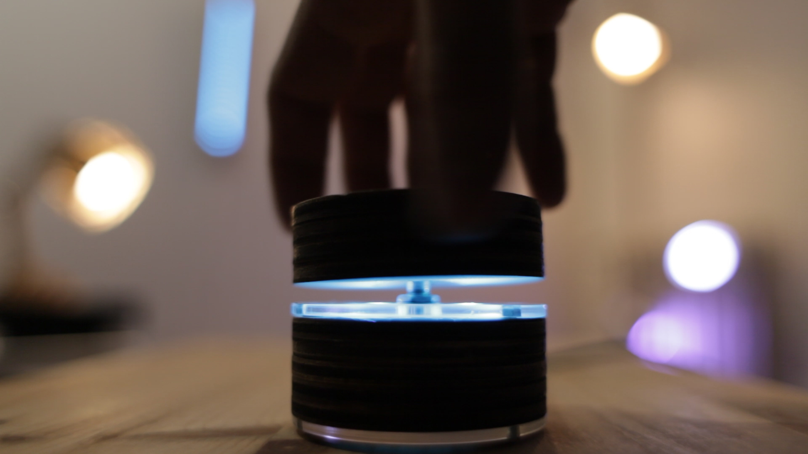

## DESCRIPTION
This is a controller for IoT devices. It uses a rotary encoder connected to an WEMOS mini v2 board (ESP8266).
here it is been programmed for controlling lights color and brightness, but can actually be used for mostly anything you want to control.

It publishes :

* a value between "0" and "255" on [knob/brightness] topic (mode 0)
* a value between "0,0,0" and "255,255,255" on [knob/color] topic (mode 1)

it changes mode by pressing the top of the encoder

## HARDWARE

* rotary encoder with push button 
* an esp8266 board (better Wemos mini because of its small size)
* (optional) addressable LEDs WS2812b - aka NEOPIXELs
* a case

the simple schematics is here:

